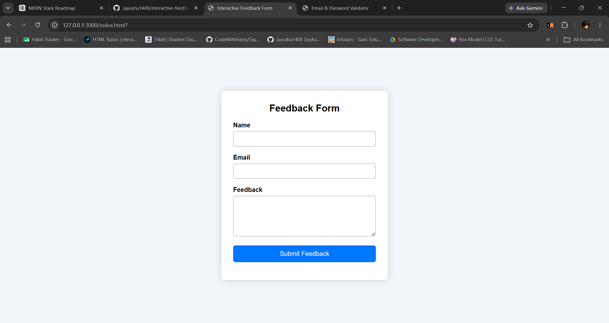

# Interactive Feedback Form with Error Highlights

An interactive feedback form built using HTML, CSS, and JavaScript.

## Features

- Name validation
- Email validation using Regex
- Feedback validation (minimum 20 characters)
- Error messages below each input
- Red border for invalid fields
- Green border for valid fields
- Success message after successful submission
- Responsive design

## Technologies Used

- HTML5
- CSS3
- JavaScript (DOM & Regex)

## Project Structure

```
interactive-feedback-form/
│── index.html
│── style.css
│── script.js
│── screenshot3.png
│── README.md
```

## Screenshot



## Author

**Jay Sahu**

## Author

**Jay Sahu**
